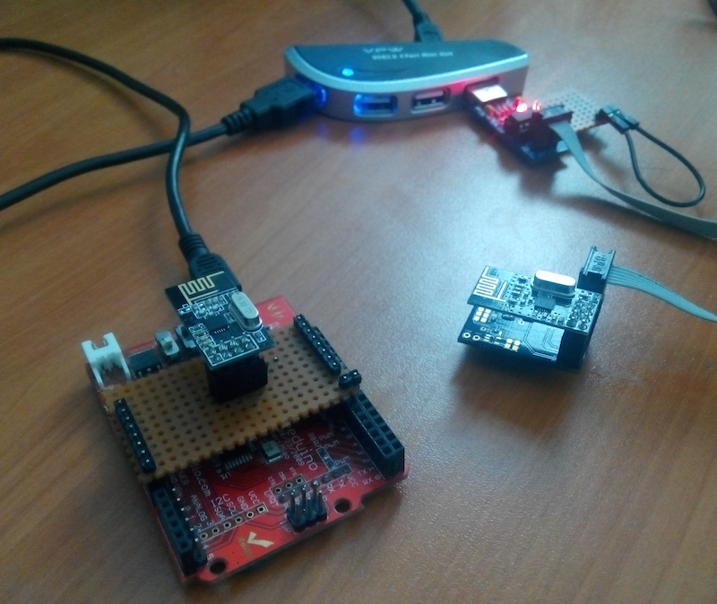

##nrf24l01_plus_bootloader

This is a nrf24l01+ based AVR bootloader focuses on low-power mode wireless sensor nodes.

###Development setup

###Couple of notes

* Uses an Arduino as an intelligent USB-nrf24L01+ dongle.
* All the firmware is written in plain C.
* Bootloader occupies ~1600 bytes memory, but 2048 bytes are spared for simplicity sake.
* User has to put _bootloader check_ function in their app code, otherwise computer can't put the node into the bootloader mode.
* How long does the node listens for a _reset message_ is related with the low current requirement of sensor node. 
* For example, if node only wakes up once for every 10 minutes and sends a temperature readout, and listens for any _reset message_  100 microseconds after that; dongle has to catch this tiny time slice in order to put the device into the _bootloader mode_. This could take long time but this is a design choice made specifically for keeping the _low power_ operating mode as intact as possible.
* Currently only works with Attiny84. 
* There are probably many edge-cases that I haven't considered yet.

###License

	/*-----------------------------------------------------------------------------
	/ “THE COFFEEWARE LICENSE” (Revision 1):
	/ <ihsan@kehribar.me> wrote this file. As long as you retain this notice you
	/ can do whatever you want with this stuff. If we meet some day, and you think
	/ this stuff is worth it, you can buy me a coffee in return.
	/----------------------------------------------------------------------------*/

